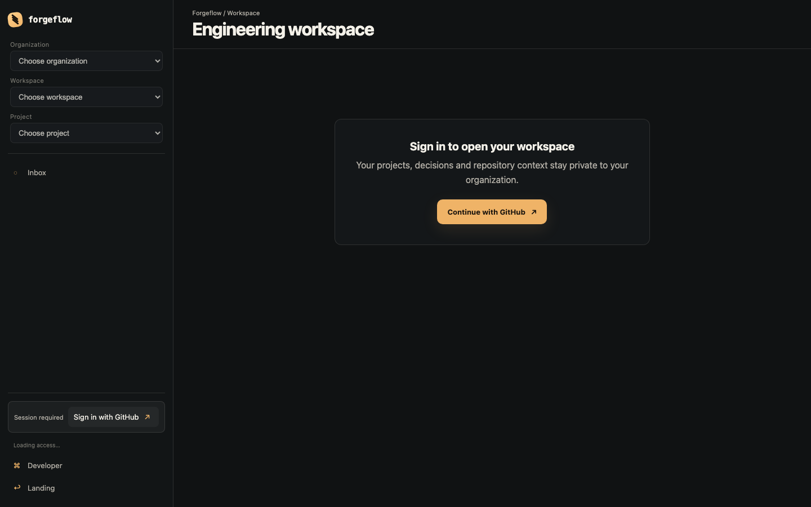
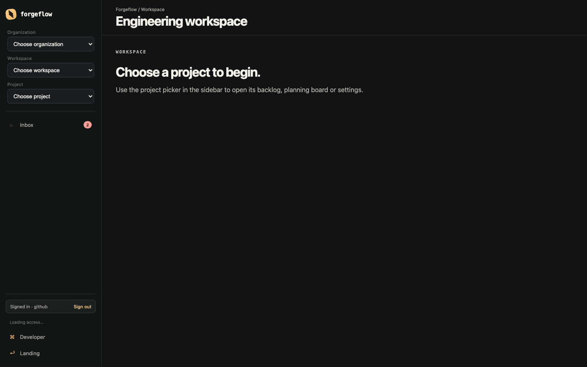
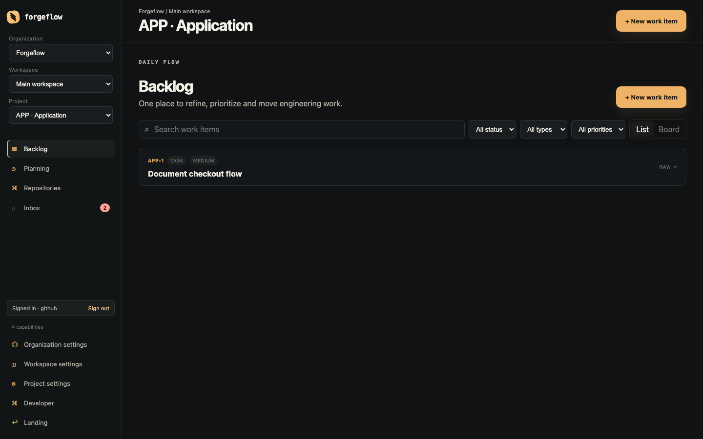
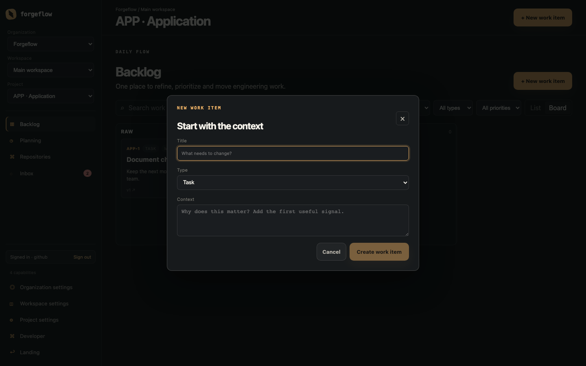
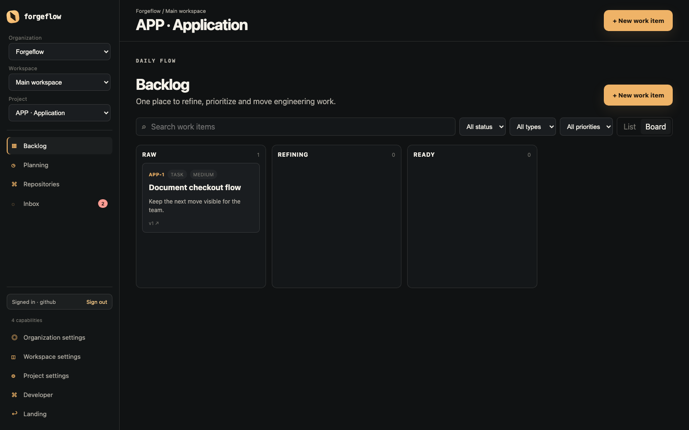
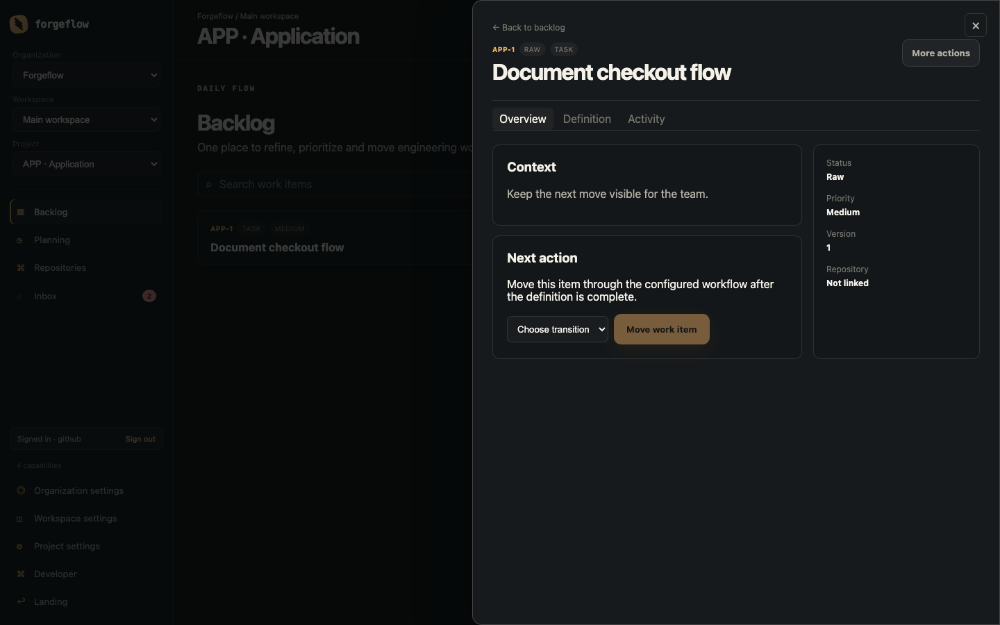
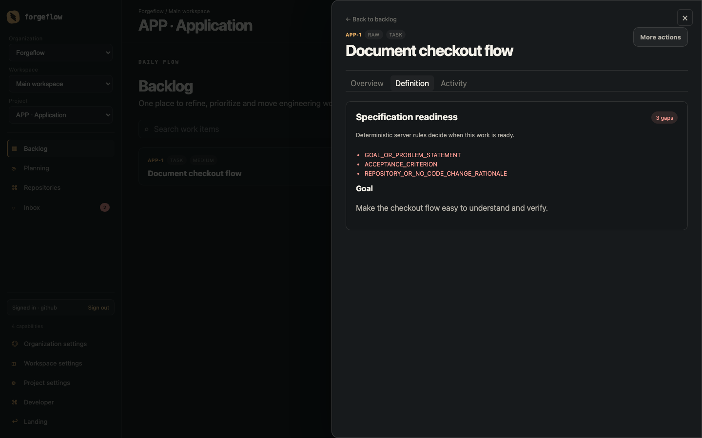
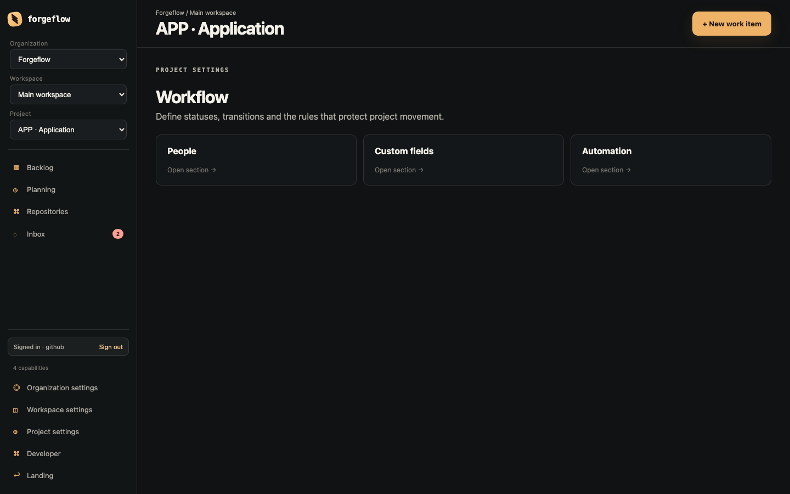
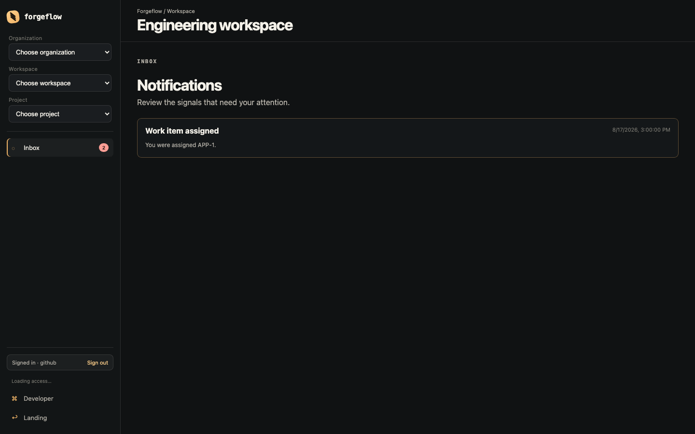

# Hướng dẫn sử dụng Forgeflow

Forgeflow giúp đội engineering chuyển một yêu cầu chưa rõ thành một Work Item có đủ ngữ cảnh, tiêu chí kiểm tra và quyết định của con người trước khi thực hiện.

Tài liệu này mô tả UI web mới đang được bật trên deployment hiện tại.

- Production: [forgeflow.vincent2k2.id.vn](https://forgeflow.vincent2k2.id.vn/app)
- Local development: `http://localhost:13000/app`
- Ảnh trong tài liệu dùng dữ liệu minh họa; tên project, quyền và trạng thái thực tế có thể khác.

Nếu cần đi theo một quy trình cụ thể từ yêu cầu → Work Item → repository → READY → code review, xem [Backlog workflow playbook](backlog-workflow.md).

## 1. Mô hình sử dụng

Forgeflow phân tách ngữ cảnh theo bốn lớp:

| Lớp | Ý nghĩa | Ví dụ |
| --- | --- | --- |
| Organization | Nhóm/tổ chức sở hữu dữ liệu | `Forgeflow` |
| Workspace | Không gian làm việc trong organization | `Main workspace` |
| Project | Sản phẩm hoặc luồng engineering cụ thể | `APP · Application` |
| Work Item | Một bug, task, story hoặc epic cần xử lý | `APP-1 · Document checkout flow` |

Mọi backlog, board, repository context, workflow và quyền truy cập đều được giới hạn theo project đang chọn. Vì vậy hãy chọn đúng Organization → Workspace → Project trước khi thao tác.

## 2. Đăng nhập và đăng xuất

### Đăng nhập

1. Mở Forgeflow.
2. Chọn **Continue with GitHub** hoặc **Sign in with GitHub**.
3. Hoàn tất xác thực GitHub.
4. Sau khi quay lại Forgeflow, chọn project ở sidebar.

Khi chưa đăng nhập, các project picker sẽ bị khóa và màn hình hiển thị **Sign in to open your workspace**. Đây là trạng thái bảo vệ dữ liệu, không phải lỗi tải trang.

### Đăng xuất

Nút **Sign out** nằm ở cuối sidebar. Sau khi đăng xuất, session phía trình duyệt được xóa và Forgeflow quay về màn hình yêu cầu đăng nhập.

## 3. Chọn Project trong đúng context

Sau khi đăng nhập, mở `/app`. Màn hình này hiển thị các project bạn có thể truy cập và lối vào nhanh cho từng project.

Thao tác:

1. Mở **Project switcher** trong sidebar.
2. Chọn option có đầy đủ Organization / Workspace / Project.
3. Forgeflow tự chuyển đến backlog của project.

Khi đổi project, hệ thống cần tải lại context, quyền và dữ liệu backlog. Trong thời gian này:

- header hiển thị **Loading project…**;
- nội dung có lớp **Loading project context…**;
- project switcher tạm thời bị khóa;
- không cần chọn lại nhiều lần.

URL project có dạng:

~~~text
/app/orgs/{orgID}/workspaces/{workspaceID}/projects/{projectID}/backlog
~~~

`orgID`, `workspaceID` và `projectID` phải thuộc cùng một hierarchy. Nếu URL bị sửa thủ công và không khớp dữ liệu server, Forgeflow hiển thị **Context not found** thay vì mở nhầm dữ liệu tenant khác.

## 4. App shell và điều hướng

Sidebar bên trái là nơi điều hướng chính:

| Khu vực | Dùng để làm gì |
| --- | --- |
| **Backlog** | Tìm, lọc, tạo và mở Work Item |
| **Planning** | Khu vực dành cho sprint, milestone và kế hoạch tiếp theo |
| **Repositories** | Context của source code và repository |
| **Inbox** | Notification cần chú ý; badge hiển thị số chưa đọc |
| **Organization settings** | Cấu hình organization và thành viên organization |
| **Workspace settings** | Cấu hình workspace và thành viên workspace |
| **Project settings** | Workflow, People, Custom fields và Automation của project |
| **Developer** | Cấu hình truy cập developer/PAT khi được bật |

Quyền hiển thị và khả năng mutation phụ thuộc vào context hiện tại. UI chỉ hiện action khi context đã có quyền phù hợp; backend vẫn kiểm tra quyền độc lập cho từng request.

## 5. Làm việc với Backlog

Backlog là entry point cho công việc hằng ngày.

### 5.1. Chế độ List

Trong List, bạn có thể:

- tìm theo tiêu đề hoặc context bằng ô **Search work items**;
- lọc theo **Status**, **Type** và **Priority**;
- chuyển sang Board bằng nút **Board**;
- bấm vào một dòng để mở Work Item detail drawer;
- dùng **Load more** khi danh sách có cursor phân trang.

Các filter được lưu trong query string để có thể copy URL hoặc dùng nút Back/Forward của trình duyệt. Ví dụ:

~~~text
/backlog?view=board&q=checkout&status=REFINING
~~~

Nếu không có item phù hợp, Forgeflow hiển thị trạng thái rỗng và nút tạo Work Item mới.

### 5.2. Tạo Work Item

1. Bấm **+ New work item**.
2. Nhập **Title** — bắt buộc.
3. Chọn **Type**: Task, Story, Bug, Epic hoặc Sub-task.
4. Nhập **Context** — lý do, tín hiệu ban đầu hoặc điều cần thay đổi.
5. Bấm **Create work item**.

Sau khi tạo thành công, Forgeflow đưa bạn đến Work Item vừa tạo để tiếp tục bổ sung definition.

Nên viết title theo dạng ngắn, có hành động hoặc kết quả mong muốn. Context không cần là specification hoàn chỉnh; mục tiêu của nó là giúp người khác hiểu vì sao item tồn tại.

### 5.3. Chế độ Board

Board chiếu các Work Item theo status column.

Bạn có thể:

- kéo thả card để đổi vị trí trong cùng column;
- kéo card sang column khác nếu workflow có transition tương ứng;
- nhìn số lượng item ở header mỗi column;
- mở detail bằng cách bấm vào card.

Nếu transition không được cấu hình hoặc có người khác cập nhật item trước đó, thao tác sẽ bị từ chối, board rollback về dữ liệu trước đó và hiển thị nút **Reload board**. Đây là cơ chế bảo vệ dữ liệu, không nên cố kéo lại liên tục trước khi reload.

## 6. Mở và xử lý Work Item

Click một row trong List hoặc card trong Board sẽ mở detail drawer. URL được cập nhật theo item nên có thể bookmark, refresh hoặc copy cho đồng đội.

Drawer có ba tab:

### Overview

- **Context**: mô tả ngắn hiện tại của item.
- **Next action**: chọn transition được workflow cho phép.
- **Status**, **Priority**, **Version**, **Repository**: metadata của item.

Để chuyển trạng thái, chọn transition rồi bấm **Move work item**. Status không nên được đổi bằng một update chung; mọi thay đổi trạng thái phải đi qua transition đã cấu hình.

### Definition

Definition là nơi kiểm tra item đã đủ rõ để chuyển sang `READY` hoặc chạy AgentRun chưa. Kết quả readiness do server tính, không phải do client tự quyết định.

Các gap thường gặp:

| Mã hiển thị | Ý nghĩa cần bổ sung |
| --- | --- |
| `GOAL_OR_PROBLEM_STATEMENT` | Mục tiêu của task/story hoặc vấn đề cần giải quyết |
| `ACCEPTANCE_CRITERION` | Ít nhất một tiêu chí nghiệm thu có thể kiểm tra |
| `REPOSITORY_OR_NO_CODE_CHANGE_RATIONALE` | Repository liên quan hoặc lý do rõ ràng rằng item không thay đổi code |
| `HUMAN_REVIEW` | Người có quyền cần review và xác nhận specification hiện tại |

Với **BUG**, readiness còn kiểm tra problem statement, expected/actual behavior, environment, reproduction steps, evidence, affected component và acceptance criteria. Với **TASK/ STORY**, trọng tâm là goal, acceptance criteria và repository context hoặc rationale.

Quy tắc thực tế:

- `3 gaps` nghĩa là item còn thiếu 3 điều kiện, không phải server bị lỗi.
- `No definition yet.` nghĩa là goal/summary hiện đang trống.
- AI proposal chỉ là gợi ý; chưa được tính là thông tin đã human-verified.
- Mỗi lần sửa specification sẽ tạo version mới và làm mất review của version cũ.
- Nếu specification đã đổi sau khi bạn mở màn hình, thao tác review cũ sẽ bị trả về stale version.

UI mới hiện có Definition editor cho summary, các field chính, reproduction steps, acceptance criteria, affected component và repository context. Sau khi lưu, hãy dùng các nút **Mark human verified** cho nội dung bạn đã kiểm tra; sau đó mới dùng **Review specification**. Không nên cố chuyển item sang `READY` để bỏ qua quality gate.

### Activity

Activity dùng để trao đổi context theo item. Nhập comment vào ô **Add useful context…** rồi bấm **Comment**. Comment mới xuất hiện trong audit/activity view sau khi lưu thành công.

### Đóng drawer và quay lại

- Bấm nút `×` ở góc phải.
- Bấm **Escape**.
- Dùng link **Back to backlog**.

Khi drawer đóng, Forgeflow khôi phục focus về row/card đã mở để thao tác bằng keyboard không bị mất vị trí.

## 7. Planning, Repositories và Settings

Các route này đã được tách khỏi backlog để tránh dồn mọi chức năng vào một màn hình.

### Planning

Mở **Planning** từ sidebar để xem khu vực dành cho sprint, milestone và priority planning. Daily execution vẫn nên thực hiện ở Backlog/Board.

### Repositories

Mở **Repositories** để đi đến khu vực repository context. Repository liên kết giúp Work Item có affected component, file, symbol, snapshot và context phục vụ review hoặc AgentRun.

### Project settings

Project settings hiện có các nhóm:

- **Workflow**: status, transition và rule bảo vệ movement;
- **People**: thành viên và project role;
- **Custom fields**: metadata riêng của project;
- **Automation**: event/action tự động hóa.

### Organization và Workspace settings

Organization và Workspace settings có hai nhóm cơ bản:

- **General**: identity và default;
- **Members**: thành viên và quyền trong đúng scope đó.

Không dùng project permission để suy ra organization/workspace permission. Nếu một mục settings không xuất hiện, kiểm tra bạn đang đứng đúng scope và có capability tương ứng.

Planning và các nhóm settings vẫn là các surface điều hướng theo phạm vi của từng module. Riêng Repositories hiện đã có flow Connect GitHub, refresh danh sách, link/unlink repository và xem engineering context cơ bản. Inbox có thể mở resource liên quan và đánh dấu từng notification hoặc tất cả là đã đọc.

## 8. Inbox và notification

Badge cạnh **Inbox** hiển thị số notification chưa đọc nhẹ để App Shell không phải tải cả danh sách notification.

1. Bấm **Inbox**.
2. Đọc title, body và thời gian của notification.
3. Mở Work Item hoặc quay lại project để xử lý signal liên quan.

Nếu badge khác với nội dung bạn vừa thấy, refresh Inbox để tải lại danh sách từ server.

## 9. Desktop Agent Runner

Desktop runner dùng cho flow cần thao tác Git và agent ở máy local. Repository và worktree vẫn nằm trên máy của bạn; Forgeflow không tự merge.

Flow an toàn đề xuất (UI đã chia thành bốn bước có thể mở/đóng):

1. **Choose repository** — chọn **Local repository path** hoặc **Choose folder**, sau đó kiểm tra branch/status.
2. **Create managed worktree** — chọn worktree name, working branch, base ref và bấm **Create worktree**.
3. **Inspect and hand off** — bấm **Inspect diff**, review rồi mới **Commit changes** hoặc **Push branch**.
4. **Run the approved agent** — chọn provider **Codex**/ **Claude**, viết **Task prompt**, tick approval và bấm **Run approved agent**.

Trạng thái của từng bước luôn hiển thị `Needs input`, `Complete the previous step`, `Ready` hoặc `Running`. Nếu có lỗi, input và worktree hiện tại được giữ lại để retry; dùng **Clean worktree** chỉ khi đã xác nhận không cần dữ liệu local nữa.

Nếu đồng bộ với Forgeflow AgentRun:

- tạo AgentRun trên web trước;
- review và approve AgentRun trên server;
- mở phần **Sync with an approved Forgeflow AgentRun**;
- nhập API URL, GitHub session hoặc short-lived PAT, Project ID và Approved AgentRun ID;
- chỉ chạy khi fingerprint của repository, base commit, diff, prompt, specification và execution policy còn khớp.

Không thay đổi worktree, prompt, provider hoặc policy sau approval mà không review lại. Approval cũ sẽ bị invalidated khi input thực thi thay đổi. AgentRun có heartbeat và recovery; nếu desktop mất kết nối, kiểm tra trạng thái run trước khi chạy lại để tránh duplicate execution.

## 10. Quyền truy cập và trạng thái lỗi

Forgeflow phân quyền theo scope:

- organization authorization;
- workspace authorization;
- project authorization.

UI dùng capability để ẩn/disable hành động, nhưng backend luôn authorize lại mutation. Các lỗi thường gặp:

| Hiện tượng | Cách xử lý |
| --- | --- |
| Không thấy project | Kiểm tra Organization/Workspace và quyền thành viên |
| `Context not found` | URL ancestor không khớp hierarchy của project; quay về `/app` rồi chọn lại |
| Backlog không tải | Bấm **Retry**, kiểm tra kết nối và thử refresh |
| Board move không lưu | Bấm **Reload board** để reconcile version mới |
| `3 gaps` hoặc `Not ready` | Bổ sung specification và human verification; đây không phải lỗi mạng |
| Đăng xuất ngoài ý muốn | Đăng nhập lại bằng GitHub; session cookie đã hết hạn có thể cần OAuth lại |
| Trang không vào được | Kiểm tra `/health/live`, refresh cứng trình duyệt và thử lại sau khi deployment ổn định |

Error response của API có request ID. Khi cần gửi cho người vận hành, hãy kèm URL hiện tại, thao tác vừa thực hiện, thời điểm và request ID; không gửi token hoặc dữ liệu bí mật.

## 11. Keyboard và mobile

- `Tab`: di chuyển giữa control.
- `Enter` hoặc `Space`: kích hoạt button/link; trên Board dùng để grab/release card.
- `ArrowLeft` / `ArrowRight`: di chuyển card giữa các column khi card đang được grab.
- `ArrowUp` / `ArrowDown`: đổi thứ tự card trong cùng column.
- `Escape`: đóng Work Item drawer.
- Mobile: bấm **Menu** để mở sidebar, chọn xong route thì sidebar tự đóng.

Focus drawer được khôi phục về item vừa mở. Không dùng màu sắc đơn lẻ để suy luận trạng thái; luôn đọc label/status và thông báo aria-live nếu có.

## 12. Checklist làm việc hằng ngày

### Khi nhận một yêu cầu mới

- [ ] Đang ở đúng Organization, Workspace và Project.
- [ ] Tạo Work Item với title rõ ràng.
- [ ] Ghi context ban đầu, không chỉ ghi một câu chung chung.
- [ ] Chọn đúng type và priority.
- [ ] Mở Definition để kiểm tra readiness.
- [ ] Bổ sung goal/problem, acceptance criteria và repository/rationale.
- [ ] Human-review specification trước khi chuyển `READY`.

### Trước khi chạy Agent

- [ ] Work Item đã qua readiness gate.
- [ ] Repository, base commit và worktree đúng.
- [ ] Diff đã được inspect.
- [ ] Prompt mô tả phạm vi và tiêu chí hoàn thành.
- [ ] Agent provider và execution policy đúng như đã approve.
- [ ] Không có input nào thay đổi sau approval.
- [ ] Biết cách rollback/recover nếu AgentRun bị gián đoạn.

### Trước khi push code

- [ ] Diff không chứa file hoặc secret ngoài phạm vi.
- [ ] Commit message mô tả thay đổi.
- [ ] Đã review commit trong worktree.
- [ ] Push đúng branch `forgeflow/*`.
- [ ] Không auto-merge; pull request vẫn cần review theo quy trình của team.

## 13. Route reference

| Route | Mục đích |
| --- | --- |
| `/app` | Chọn project/context |
| `/app/orgs/:orgID/workspaces/:workspaceID/projects/:projectID/backlog` | Backlog List/Board |
| `/app/orgs/:orgID/workspaces/:workspaceID/projects/:projectID/work-items/:itemID` | Work Item full page |
| `/app/orgs/:orgID/workspaces/:workspaceID/projects/:projectID/planning` | Planning |
| `/app/orgs/:orgID/workspaces/:workspaceID/projects/:projectID/repositories` | Repository context |
| `/app/orgs/:orgID/workspaces/:workspaceID/projects/:projectID/settings/:section` | Project settings |
| `/app/orgs/:orgID/settings/:section` | Organization settings |
| `/app/orgs/:orgID/workspaces/:workspaceID/settings/:section` | Workspace settings |
| `/app/inbox` | Notification inbox |
| `/app/account/developer` | Developer access |

## 14. Nguyên tắc sử dụng Forgeflow

1. Chọn đúng context trước khi làm việc.
2. Backlog là nơi bắt đầu, không phải nơi chứa mọi cấu hình.
3. Specification phải đủ rõ trước automation.
4. AI đưa ra đề xuất; con người xác minh.
5. Transition và mutation phải đi qua rule server.
6. Diff, commit và push đều là các điểm review riêng.
7. Không có autonomous merge; thay đổi quan trọng luôn giữ được khả năng kiểm tra và phục hồi.
